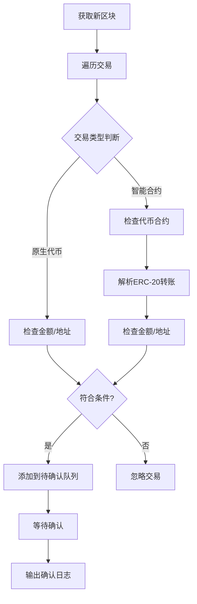

# EVM转账监控器项目文档

> 代码是写给人看的，只是机器恰好可以运行

## 项目概述

EVM转账监控器是一个Python异步应用程序，专门用于监控EVM兼容区块链上的交易活动。该项目支持多条区块链网络，包括BSC、Ethereum、Polygon、Arbitrum、Optimism和Core DAO等主流网络。

## 核心特性

### 🌍 多链支持
- **BSC**: 2个确认 (~6秒)
- **Ethereum**: 12个确认 (~2.4分钟) 
- **Polygon**: 50个确认 (~1.7分钟)
- **Arbitrum**: 5个本地确认 + 12个L1确认 (~2.5分钟)
- **Optimism**: 5个本地确认 + 12个L1确认
- **Core DAO**: 20个确认

### 📊 双监控策略
1. **大额交易监控**: 检测超过设定阈值的交易
2. **指定地址监控**: 监控特定钱包地址的转账活动

### 🪙 代币支持
- 原生代币 (ETH, BNB, CORE等)
- 稳定币 (USDT, USDC, BUSD)
- 自定义ERC-20代币

### 🛡️ 智能确认系统
- 基于链特性的动态确认数
- 大额交易额外安全确认
- Layer2链特殊处理机制

## 项目架构

### 目录结构
```
evm_transfer_monitor/
├── main.py                    # 程序入口点
├── config.yml                 # 主配置文件
├── watch_addr.json            # 监控地址列表
│
├── config/                    # 配置模块
│   ├── base_config.py         # 基础配置加载器
│   └── monitor_config.py      # 监控配置管理
│
├── core/                      # 核心模块
│   └── evm_monitor.py         # 主监控器
│
├── models/                    # 数据模型
│   └── data_types.py          # 数据类型定义
│
├── managers/                  # 管理器模块
│   ├── rpc_manager.py         # RPC调用管理
│   └── confirmation_manager.py # 交易确认管理
│
├── processors/                # 处理器模块
│   └── transaction_processor.py # 交易处理器
│
├── utils/                     # 工具模块
│   ├── log_utils.py           # 日志工具
│   ├── token_parser.py        # 代币解析工具
│   ├── load_address.py        # 地址加载工具
│   └── chain_config.py        # 链配置工具
│
├── reports/                   # 报告模块
│   └── statistics_reporter.py # 统计报告器
│
├── docs/                      # 文档目录
│   ├── REFACTOR_GUIDE.md      # 重构指南
│   ├── load_address_usage.md  # 地址加载使用说明
│   └── processing_time_stats.md # 处理时间统计
│
├── examples/                  # 示例代码
│   └── processing_time_example.py
│
└── logs/                      # 日志目录
    └── evm_transfer_monitor.log
```

### 模块职责分工

#### 📁 core/ - 核心模块
**evm_monitor.py**: 主监控器，系统的协调中心
- 统一的监控接口和控制逻辑
- 支持两种监控策略的动态切换
- 信号处理和优雅关闭
- 健康状态监控

#### 📁 config/ - 配置管理
**base_config.py**: 配置文件加载器
- YAML配置文件解析
- 多链配置管理
- 活跃链配置提取

**monitor_config.py**: 监控专用配置类
- 支持双监控策略配置
- 动态阈值管理
- 地址列表管理
- 配置验证和切换

#### 📁 managers/ - 管理器层
**rpc_manager.py**: RPC调用管理器
- Web3连接管理
- 缓存机制优化
- 速率限制控制
- 性能统计

**confirmation_manager.py**: 交易确认管理器
- 待确认交易追踪
- 确认状态检查
- 超时处理机制
- 确认统计

#### 📁 processors/ - 处理器层
**transaction_processor.py**: 交易处理器
- 双策略交易检测
- 原生代币处理
- ERC-20代币解析
- 交易分类统计

#### 📁 utils/ - 工具层
**token_parser.py**: 代币解析器
- 多链代币支持
- ERC-20转账解析
- 地址格式验证
- 金额格式化

**load_address.py**: 地址加载工具
- JSON配置文件读取
- 地址格式验证
- 错误处理机制

#### 📁 reports/ - 报告模块
**statistics_reporter.py**: 统计报告器
- 实时性能监控
- 处理时间统计
- 最终报告生成
- 峰值记录

#### 📁 models/ - 数据模型
**data_types.py**: 核心数据结构
- `TransactionInfo`: 交易信息
- `PerformanceMetrics`: 性能指标
- `TransactionStats`: 交易统计
- `MonitorStatus`: 监控状态

## 配置系统

### 主配置文件 (config.yml)

#### 链配置示例
```yaml
chains:
  bsc:
    rpc_url: "https://bsc-dataseed.binance.org/"
    scan_url: "https://bscscan.com"
    token_name: "BNB"
    chain_id: 56
    confirmation_blocks: 12
    block_time: 3
    usdt_contract: "0x55d398326f99059fF775485246999027B3197955"
    usdc_contract: "0x8ac76a51cc950d9822d68b83fE1Ad97B32Cd580d"
    custom_tokens:
      - symbol: "CAKE"
        contract: "0x0e09fabb73bd3ade0a17ecc321fd13a19e81ce82"
        decimals: 18
```

#### 监控配置
```yaml
monitor:
  default_confirmation_blocks: 10
  scan_interval: 10
  max_retries: 3
  min_amount_thresholds:
    USDT: 100
    USDC: 100
    default: 50
  high_value_thresholds:
    USDT: 100000
    USDC: 100000
    default: 50000
  high_value_extra_confirmations: 5
```

### 地址配置文件 (watch_addr.json)
```json
{
  "evm_wallet_addresses": [
    "0x40172dd8d59C31660c50d17a6cE941883481bfFB",
    "0xA56E166a5Eb85080eE7A89E52ab15Bdd85Ecf7D7",
    "0xD624C65471Ea9bd198E3c12Fea462ef9c9db3c55",
    "0x9055993F0BCDa80eAbe2616101330Ea06d9d6051"
  ]
}
```

## 使用指南

### 基本启动
```bash
# 使用默认链 (BSC)
python main.py

# 指定监控链
python main.py ethereum
python main.py polygon
python main.py core
```

### 监控策略配置

#### 1. 大额交易监控
```python
from config.monitor_config import MonitorConfig, MonitorStrategy

config = MonitorConfig.from_chain_name("bsc")
config.set_strategy(MonitorStrategy.LARGE_AMOUNT)
config.update_thresholds(
    BNB=10.0,
    USDT=50000.0,
    USDC=50000.0
)
```

#### 2. 指定地址监控
```python
config.set_strategy(MonitorStrategy.WATCH_ADDRESS)
config.add_watch_address("0x...")
config.remove_watch_address("0x...")
```

### 代币解析使用
```python
from utils.token_parser import TokenParser

# 创建链特定解析器
bsc_parser = TokenParser('bsc')
eth_parser = TokenParser('ethereum')

# 解析代币转账
result = bsc_parser.parse_usdt_transfer(transaction)
if result:
    print(f"转账金额: {result['amount']} {result['token']}")
    print(f"从: {result['from']} 到: {result['to']}")
```

## 核心功能详解

### 1. 交易检测流程



### 2. 确认机制

#### 基础确认规则
- **BSC**: 2个确认 (网络稳定，重组风险低)
- **Ethereum**: 12个确认 (行业标准)
- **Polygon**: 50个确认 (防止链重组)
- **Layer2**: 本地确认 + L1最终确认

#### 智能确认增强
```python
# 大额交易自动增加确认数
if transaction_amount > high_value_threshold:
    required_confirmations += extra_confirmations
```

### 3. 性能优化

#### RPC调用优化
- **缓存机制**: 区块号缓存1.5秒
- **速率限制**: 自动控制调用频率
- **批量处理**: 减少网络请求

#### 内存管理
- **超时清理**: 自动清理超时交易
- **统计重置**: 支持运行时统计重置
- **优雅关闭**: 完整的关闭流程

### 4. 日志系统

#### 日志级别
- **INFO**: 基本运行信息
- **WARNING**: 异常情况警告
- **ERROR**: 错误信息和堆栈
- **DEBUG**: 详细调试信息

#### 日志格式示例
```
💰 大额BNB: 0x123... => 0x456... | 15.50 BNB | Gas: 0.0021 BNB | 区块: 12345678
✅ BNB交易确认: 0x123... => 0x456... | 15.50 BNB | 确认数: 12
📊 性能统计 | 运行: 2.5h | 区块: 1850 | 交易: 23 | 待确认: 5
```

## 扩展和自定义

### 添加新区块链网络

1. **配置文件更新**
```yaml
chains:
  new_chain:
    rpc_url: "https://rpc.newchain.com"
    scan_url: "https://scan.newchain.com"
    token_name: "NEW"
    chain_id: 12345
    confirmation_blocks: 15
    block_time: 5
    usdt_contract: "0x..."
```

2. **代码自动支持**: 无需修改代码，配置驱动设计

### 添加新代币支持

```yaml
custom_tokens:
  - symbol: "NEWTOKEN"
    contract: "0x..."
    decimals: 18
```

### 自定义监控逻辑

继承 `TransactionProcessor` 类：
```python
class CustomTransactionProcessor(TransactionProcessor):
    def custom_filter(self, tx):
        # 自定义过滤逻辑
        return custom_condition
```

## 监控和运维

### 健康检查
```python
health = monitor.get_health_status()
print(f"系统健康: {health['overall_healthy']}")
print(f"RPC健康: {health['rpc_healthy']}")
print(f"待确认交易: {health['pending_transactions']}")
```

### 性能监控
```python
stats = monitor.get_comprehensive_stats()
print(f"RPC调用: {stats['rpc_performance']['rpc_calls']}")
print(f"缓存命中率: {stats['rpc_performance']['cache_hit_rate']:.1f}%")
print(f"处理区块: {stats['blocks_processed']}")
```

### 实时配置调整
```python
# 动态调整阈值
monitor.update_thresholds(USDT=80000.0, USDC=80000.0)

# 添加监控地址
monitor.add_watch_address("0x...")

# 切换监控策略
monitor.set_monitor_strategy("large_amount")
```

## 故障排除

### 常见问题

#### 1. RPC连接问题
```
错误: 网络连接失败: HTTPSConnectionPool...
解决: 检查RPC URL配置，尝试其他RPC节点
```

#### 2. 交易解析失败
```
警告: 解析USDT转账失败: list index out of range
原因: input数据格式异常或合约调用非标准
影响: 不影响其他交易检测，会记录debug日志
```

#### 3. 确认超时
```
警告: USDT交易确认超时: 0x...
原因: 交易可能被丢弃或网络拥堵
处理: 自动清理，不影响新交易检测
```

### 性能调优

#### RPC优化
```python
# 降低调用频率
config.max_rpc_per_second = 3

# 增加缓存时间
config.cache_ttl = 2.0
```

#### 内存优化
```python
# 减少待确认交易超时时间
config.transaction_timeout = 180  # 3分钟

# 增加清理频率
config.confirmation_check_interval = 5  # 5秒
```

## 技术栈和依赖

### 核心依赖
- **Python 3.8+**: 基础运行环境
- **Web3.py**: 以太坊交互库
- **PyYAML**: 配置文件解析
- **asyncio**: 异步编程支持

### 开发依赖
- **typing**: 类型注解支持
- **dataclasses**: 数据类支持
- **pathlib**: 路径处理
- **collections**: 数据结构工具

### 系统要求
- **CPU**: 1核心以上
- **内存**: 512MB以上
- **网络**: 稳定的网络连接
- **存储**: 100MB可用空间

## 安全考虑

### 私钥安全
- 监控器只读取区块链数据，不涉及私钥
- 监控地址存储在配置文件中，注意文件权限

### 网络安全
- 使用HTTPS RPC端点
- 支持多个RPC节点故障转移
- 速率限制防止API滥用

### 数据安全
- 日志文件轮转，防止磁盘占满
- 敏感信息脱敏处理
- 配置文件访问权限控制

## 许可证

MIT License - 允许自由使用、修改和分发

## 贡献指南

### 代码风格
- 遵循 PEP 8 标准
- 使用类型注解
- 添加详细的文档字符串
- 保持函数简洁，单一职责

### 提交规范
- 清晰的提交信息
- 功能分支开发
- 代码审查流程
- 测试覆盖要求

### 开发原则
正如项目座右铭所说：**"代码是写给人看的，只是机器恰好可以运行"**

- 可读性优于简洁性
- 文档和注释要详细
- 变量命名要有意义
- 模块职责要清晰

## 总结

EVM转账监控器是一个功能完整、架构清晰的区块链监控系统。通过模块化设计和配置驱动的方式，实现了高度的可扩展性和可维护性。无论是监控大额交易还是特定地址的活动，都能提供准确、及时的监控服务。

项目的核心优势在于：
- **多链支持**: 覆盖主流EVM网络
- **双监控策略**: 灵活的监控模式
- **智能确认**: 基于链特性的安全机制
- **性能优化**: 缓存和速率限制
- **易于扩展**: 配置驱动的设计
- **代码质量**: 遵循最佳实践，注重可读性

这个项目体现了现代软件开发的最佳实践，是学习区块链应用开发的优秀示例。