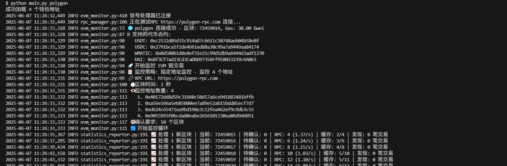
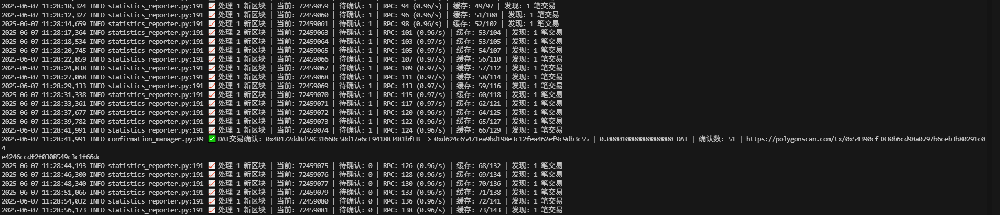
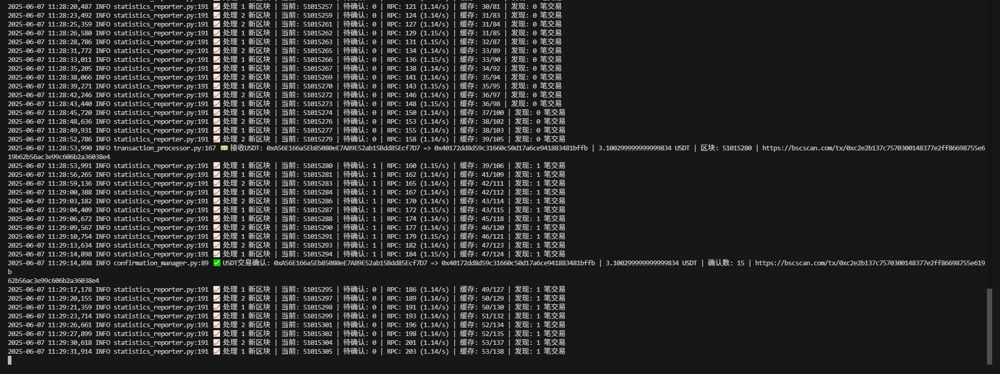
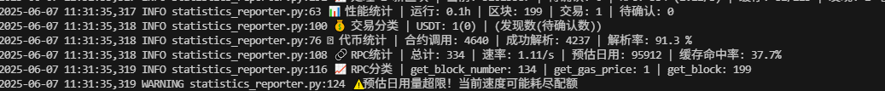

# EVM监控器 - 重构版本

### 运行截图

#### 监听 polygon




#### 监听 DAI 转账




#### 监听 bsc



#### 性能统计



## 🏗️ 架构设计

### 核心组件

1. **MonitorConfig** - 配置管理
   - 集中管理所有配置参数
   - 支持动态更新阈值
   - 提供配置验证功能

2. **RPCManager** - RPC调用管理
   - Web3连接管理
   - 智能缓存机制
   - API调用限制控制
   - 性能统计

3. **TransactionProcessor** - 交易处理
   - 原生代币交易检测
   - ERC20代币交易解析
   - 大额交易识别
   - 交易统计

4. **ConfirmationManager** - 确认管理
   - 跟踪待确认交易
   - 自动确认检查
   - 超时交易清理
   - 确认状态统计

5. **StatisticsReporter** - 统计报告
   - 实时性能监控
   - 详细统计报告
   - 峰值指标追踪
   - 健康状态检查

6. **EVMMonitor** - 主监控器
   - 协调各组件工作
   - 提供统一接口
   - 优雅启停控制
   - 信号处理

## 🚀 快速开始

### 基本使用

```python
import asyncio
from refactored import create_monitor

async def main():
    # 创建默认配置的监控器
    monitor = create_monitor()
    
    # 开始监控
    await monitor.start_monitoring()

if __name__ == '__main__':
    asyncio.run(main())
```

### 自定义配置

```python
from refactored import create_custom_config, EVMMonitor

# 创建自定义配置
config = create_custom_config(
    required_confirmations=5,
    thresholds={
        'BNB': 1.0,
        'USDT': 10000,
        'USDC': 10000
    },
    max_rpc_per_second=3
)

# 使用自定义配置
monitor = EVMMonitor(config)
```

### 动态配置更新

```python
# 更新交易阈值
monitor.update_thresholds(
    BNB=2.0,
    USDT=20000,
    ETH=1.0  # 添加新代币
)

# 更新其他配置
monitor.update_config(
    required_confirmations=6,
    cache_ttl=3.0
)
```

## 📊 监控功能

### 支持的交易类型

1. **原生代币转账** (如 BNB、ETH)
   - 自动检测大额转账
   - Gas费用计算
   - 实时通知

2. **ERC20代币转账**
   - USDT、USDC等主流稳定币
   - 自动解析转账数据
   - 支持自定义代币合约

### 确认机制

- 可配置的确认区块数
- 自动跟踪确认状态
- 超时交易清理
- 区块重组检测

### 性能优化

- 智能缓存机制
- API调用频率控制
- 批量处理优化
- 资源使用监控

## 🔧 配置说明

### 基础配置

```python
config = MonitorConfig(
    rpc_url="https://bsc-dataseed.binance.org/",
    required_confirmations=3,      # 确认区块数
    cache_ttl=1.5,                # 缓存时间(秒)
    transaction_timeout=300,       # 交易超时(秒)
)
```

### 阈值配置

```python
thresholds = {
    'BNB': 1.0,      # BNB >= 1.0
    'USDT': 10000.0, # USDT >= 10,000
    'USDC': 10000.0, # USDC >= 10,000
}
```

### API限制配置

```python
config = MonitorConfig(
    max_rpc_per_second=4,    # 每秒最大RPC调用
    max_rpc_per_day=90000,   # 每天最大RPC调用
)
```

## 📈 统计功能

### 实时统计

- RPC调用次数和频率
- 缓存命中率
- 交易发现数量
- 待确认交易数

### 性能指标

- 区块处理速度
- 内存使用情况
- API配额使用率
- 峰值性能记录

### 健康检查

```python
health = monitor.get_health_status()
print(f"整体健康: {health['overall_healthy']}")
print(f"RPC健康: {health['rpc_healthy']}")
print(f"待确认交易: {health['pending_transactions']}")
```

## 🛡️ 错误处理

### 网络错误

- 自动重连机制
- 失败重试策略
- 优雅降级处理

### 数据错误

- 交易解析失败处理
- 区块数据验证
- 异常数据过滤

### 系统错误

- 内存不足处理
- 信号处理
- 优雅关闭

## 📝 日志记录

### 日志级别

- `INFO`: 重要事件和统计
- `WARNING`: 异常情况
- `ERROR`: 错误信息
- `DEBUG`: 详细调试信息

### 日志内容

- 大额交易发现
- 确认状态更新
- 性能统计报告
- 系统状态变化

## 🔄 与原版对比

### 改进点

1. **模块化设计**: 将2000+行代码拆分为7个专门模块
2. **职责分离**: 每个模块负责特定功能
3. **可维护性**: 更容易理解、修改和扩展
4. **可测试性**: 每个组件可独立测试
5. **配置管理**: 统一的配置管理机制
6. **错误处理**: 更完善的异常处理
7. **文档完善**: 详细的代码注释和文档

### 兼容性

- 保持与原版相同的核心功能
- API接口基本一致
- 配置文件格式兼容
- 日志输出格式一致

## 🧪 测试和调试

### 单元测试

```python
# 测试RPC管理器
rpc_manager = RPCManager(config)
connection_info = await rpc_manager.test_connection()
assert connection_info['success'] == True

# 测试配置管理
config = MonitorConfig()
config.update_thresholds(BNB=2.0)
assert config.get_threshold('BNB') == 2.0
```

### 调试模式

```python
import logging
logging.basicConfig(level=logging.DEBUG)

# 启用详细日志
monitor = create_monitor()
```

## 📚 示例代码

查看 `example_usage.py` 了解详细的使用示例，包括：

- 基本使用方法
- 自定义配置
- 组件独立使用
- 动态配置更新
- 统计信息获取
- 监控演示

## 🤝 贡献指南

1. 保持代码风格一致
2. 添加必要的注释和文档
3. 编写单元测试
4. 遵循"代码是写给人看的"原则

## 📄 许可证

与原项目保持相同的许可证。

---

**注意**: 这个重构版本专注于代码结构的改进，保持了原有功能的完整性。使用前请确保相关依赖（`log_utils`、`config`、`token_parser`）可用。
